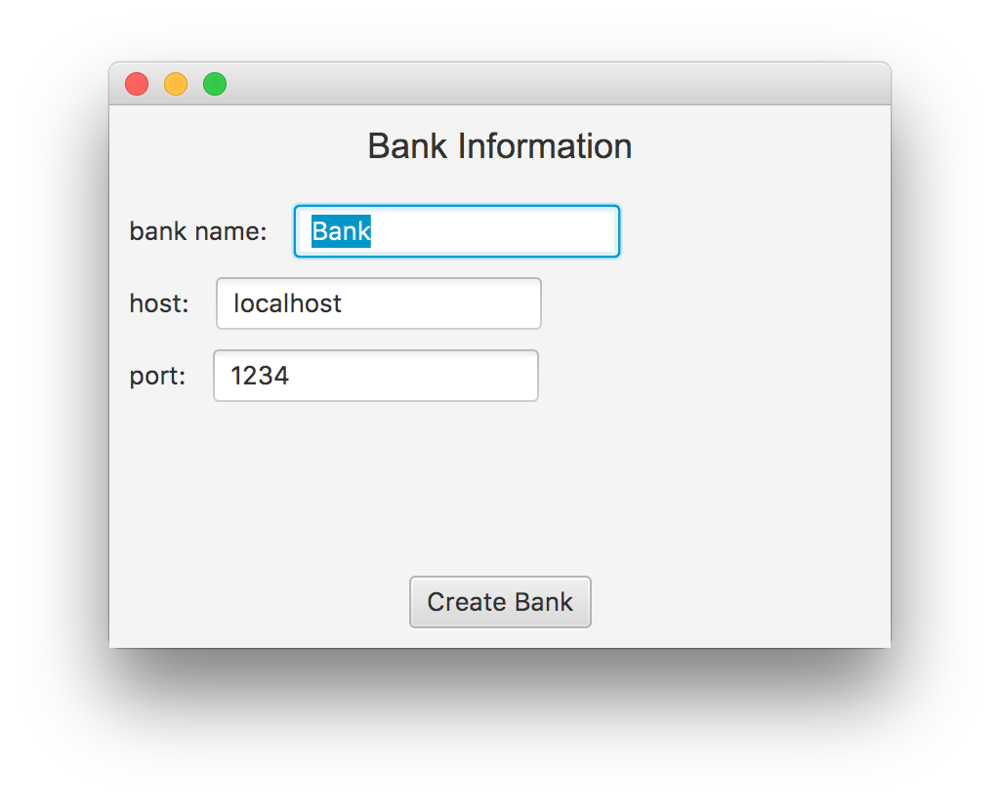
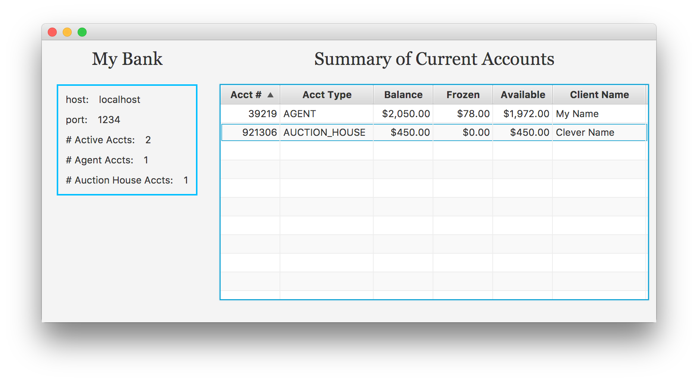

# Auction House #

The Auction House project is a simulation (and graphical representation) of
a network-based interactive triplet of programs consisting of a Bank, one or
more Auction Houses, and one or more Agents or users who bid on items
available for perusal from an Auction House. Agents and Auction Houses open
accounts with the Bank, which then serves as a clearing house for monetary
transactions between an Agent and an Auction House.

## Getting Started ##

The project can be run directly from the latest trio of .jar file(s):

`Bank.jar` 
`AuctionHouse.jar` 
`Agent.jar`

which can be downloaded and opened directly on a single computer or on
multiple computers (for example, with Bank, AuctionHouse, and Agent all
running on separate computers simultaneously, but on the same network).
The project could also be run from inside IntelliJ IDEA, with the
access point being the Main class in the Bank and AuctionHouse packages and
the Agent class in the Agent package.

Because of the connectivity dependence among the three components, it works
best to start the Bank first, then the other two components in either order.
The design envisioned the use of a single Bank object with multiple
instantiations of both Agents and Auction Houses. 

## Running the Program: Participating in an Auction ##

The most straightforward startup process involves the following
sequence of steps (see more detailed explanation further below):

<ol>
<li>Start the Bank;</li>
<li>Start one or more Auction Houses;</li>
<li>Start one or more Agents.</li>
</ol>

**(1) Starting the Bank.** The user is presented with a small GUI asking for
a name for the Bank and the hostname and port number from which you want to
run the Bank. The initial default values are set to work when running all
three components on a single machine. For multiple machines on a single
network, set the hostname to the network-designated name of the computer
on which you are running the Bank
(in a computer lab, the machines are often labeled with their network id)
and the desired port number. Both the hostname and port number will be needed
when completing the start-up process for an Auction House and an Agent.
See the screen shot of the initial Bank GUI below (or see the file
`BankGUI01.png` in the src/resource folder if the image does not appear):

Once you supply the appropriate hostname and port number and click on the
`Create Bank` button, a new GUI appears that lets you monitor the active
account information for the Bank. An example of this interface is shown
below (or see the file `BankGUI01.png` in the src/resource folder if the
image does not appear):

Along the left-hand side you will see the designated name (at the top),
the hostname, and the port number being used, along with the total
number of current accounts and a break-down of those accounts into the
number of Agent accounts and the number of Auction House accounts. On the
right appears a constantly updating table of current bank accounts. The bank
account information includes the unique Bank Account number, the account
type (AGENT vs. AUCTION_HOUSE), the current overall balance, the portion of
the overall balance that has been frozen or held (for a bidding process),
the "available" non-frozen funds remaining from the overall balance, and
any name associated with the account.

As clients connect and disconnect from the Bank, you will see accounts
appear and disappear from the list. As Agents participate in the bidding
process, you will see their balances fluctuate and eventually you will
see money being transferred from Agent accounts to Auction House accounts.

You can close the Bank by quitting or closing the Bank window, but you will
receive a warning and be unable to close the Bank if there are active
accounts.

**(2) Starting an Auction House.** In the process of starting up an
Auction House, the Auction House automatically connects to the Bank. Thus
you will want to start up the Bank first. With the Bank already running,
starting up an Auction Hosue presents you with a GUI like that shown below
(or see the file `AuctionHouseGUI01.png` in the src/resource folder if the
image does not appear):

Supply a name for the Auction House, its hostname (machine location), and
the communication port you want to use,then the hostname and port number
for the Bank (obtained or specified earlier when starting up the Bank).
Hitting the `Create Auction House` button when then close that window and
the Auction House monitoring window appears, looking like this (or see
the file `AuctionHouseGUI01.png` in the src/resource folder if the
image does not appear):

Across the top you will see the Auction House name and a unique,
randomly-generated integer ID number corresponding to the Auction House's
bank account number, the Auction House's current bank balance (which will
be $0 when first started), and the amount owed the Auction House from Agents
who have won bids on auction items.

In the bottom pane you will seem some brief information describing
connection activity, beginning with the Auction House's connection to the
Bank, and giving details about Agents connecting to the AH.

In the center pane you will see a table listing the items up for auction at
this Auction House. The STATE column tells you if bidding is OPEN (but no
bids received yet), BIDDING (meaning at least one bid has been received),
or CLOSED (meaning the item has sold). Once a bid has been accepted by the
AH as valid, the Current Bid column reflects the newly accepted bid and a bid
timer is started and shown in the Bid Timer column, counting down from 30
seconds. If no other valid, out-performing bid is received on such an item
before the 30 seconds are up, the item is marked as SOLD to the bidding Agent,
the line item turns red, and an alert is sent along to the Agent. The winning
bid amount is added to the "Amount Owed" along the top.

You can close an Auction House by quitting or closing its window, but the
Auction House will refuse to close down if there are agents connected to
the Auction House. Once all Agents are disconnected from the Auction House,
the Auction House can be closed. When it eventually closes, it closes its
account with the Bank and you will see that manifest in the Bank by the
account disappearing from the Bank GUI.

**(3) Starting an Agent.** Similar to the Auction House start-up procedure,
starting up an Agent elicits an initial window asking for information about
the location and port number for the Bank (so it is wise to have the
Bank going first). An example startup window for an Agent is shown below
(or see the file `AgentGUI1.png` in the src/resource folder if the
image does not appear):

This allows you to specify the information needed for a
Bank connection, as well as specifying information about the Agent's own
location and preferred port for receiving communications. Hitting the
`Submit` button then leads to another small GUI, allowing you
to specify a user name for the Agent and a starting bank account balance:

The agent interface window then appears as shown below (or see the file
`AgentGUI3.png` in the src/resource folder if the image does not appear):

which opens on the Bank tab, showing the name of the Bank, the chosen name
of the Agent, the Agent's bank account number, and the Agent's bank account
balance (the full balance, plus the un-frozen or “available” portion of the
full balance).

**(4) Agent Participating in an Auction.**  On the Bank tab, you can
click the `Ask For Auctions` button and receive a list (from the Bank) of
Auction Houses available. Selecting one of the Auction Houses from the list
and hitting the `Join` button produces a new tab just for that Auction House,
displaying the auction items available from that Auction House. An example
Auction House tab is shown in the image below (or see the file
`AgentGUI4.png` in the src/resource folder if the image does not appear):

Selecting an item from that list of auction items transfers some of the
information about that item over to the right-hand pane and allows you to
submit a bid on that item. If there is an image available for the item, the
image will be displayed.

Hitting the `Bid` button will send the bid along to the auction house and
a pop-up alert window advising that the bid was either accepted or rejected.
If the bid is accepted and no outperforming bids come in on that auction item,
then in approximately 30 sends you will receive another alert popup window
that you have won that item.

Money owed the Auction House is frozen in the Agent's account, but is not
automatically transferred. Instead, from the Bank tab, you must initiate
the transfer of funds yourself, either one at a time by clicking on each
pending transaction and clicking the `Transfer Funds` button, or by clicking
on the `Transfer Funds` button with no selection made, in which case all
pending transfers will be processed. As bids are made and transfers are
processed, you can click on the `Get Balance` button in the Bank tab to
update your balance information.

You can close an Agent by clicking the `Leave` button on the Bank tab,
but the agent will not be able to close until it has (1) completed all
manual transfers built up from the bidding process, and (2) closed all
Auction House accounts. An Agent can disconnect from an Auction House using
the `Leave` button on the Auction House tab, but will not be allowed to
leave an Auction House until the relevant transfer transactions are completed
with the Bank.

something here about synchronization of BankAccount methods?

## Extras ##

The project includes … 

## Built With ##

The program was written in Java and JavaFX, using IntelliJ IDEA,
in both MacOS and Windows environments.

## Authors and Contributors ##

Authors (alphabetical by last name): 
Liam Brady (lb) 
Warren D. Craft (wdc) 
Tyler Fenske (thf) 
(along with hints and help, of course, from the
instructors and course TAs). Also see acknowledgments below.

## Acknowledgments ##

THF was largely responsible for initial breakthroughs in understanding and
implementing a fundamental communication service for establishing network
communication among the three project components, and then was largely
responsible for development of the Auction House component.

LB was largely responsible for development of the Agent component.

WDC was largely responsible for the Bank component.

Initial development relied heavily on the Knock!Knock! code supplied by
lab instructor Brooke Chenoweth (with that code borrowed and modified from
https://docs.oracle.com/javase/tutorial/networking/sockets/clientServer.html).

## Some Development Notes ##

<b>Thurs, Fri, Sat 11/15 -- 11/17.</b>  1st intensive meetings of our trio,
reviewing project specifications and
considering plausible designs for the main components of Bank, Agent, and
Auction House. Activities included review and implementation of the
Knock!Knock! code provided by lab instructor Brooke Chenoweth, discussion
of possible Message class structure, and discussion of various aspects of the
design suggested by the class instructor Prof. Roman.

<b>Mon 11/19 -- Mon 11/26</b>. Handful of multi-hour-long meetings hammering
out design and details of message-passing/message-specification for
communicating between locations within a network.

<b>Tues 11/27 -- Fri 11/30</b>. Several hour-long meetings investigating the
behavior of the trio of Bank, Agent, and Auction House classes over a network.
Intensive coding by all three project partners.

<b>Sat 12/01 -- Fri 12/07</b>. Continued coding, with occasional face-to-face
meetings, clearing up operational bugs and clarifying desired behaviors for
Bank, Agents, and Auction Houses.

## Design & Design Issues ##

The general design is shown in the instance diagram included in the /doc
directory.

## Known Issues ##

(1)

(2) 

## Further Development ##

The program functions well and conforms well to the assignment's
specifications. Some next steps in development could include:

(1) [topic] … allowing the deposit and withdrawal of other funds, instead of
just allowing an initial deposit at the time of bank account creation

(2) [topic] … looking more carefully at simulating potential security
protocols (e.g. instituting more and better checks on Message content and
Message origination to verify validity of sender and validity of requested
actions, )

(3) [topic] … further enabling Bank class for message origination

(4) [topic] … generalizing the system to admit other types of actors —
for example, allowing multiple Banks, allowing Banks to have accounts
with other Banks, the automated creation of multiple Auction Houses with
speciality items …

